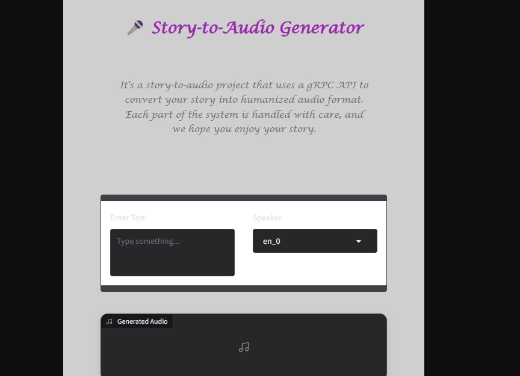
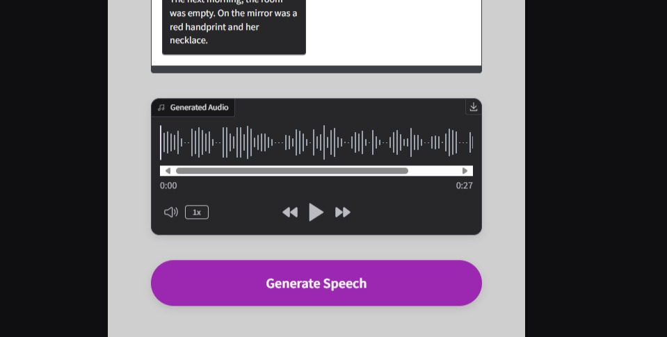
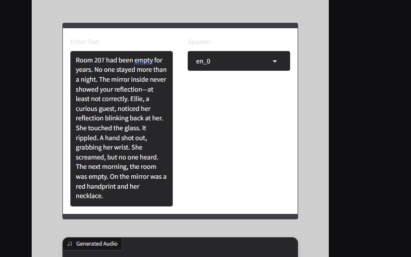

# Pretrained_Story_to_Audio_Model_Integration_CPU-GPU
In this repository there will be the two types of approaches to convert story to audio One of which is CPU approach while the other is GPU approach
## Table of Contents:
1. [Problem Statement](#Problem-Statement)
2. [Approach 1: CPU](#approach-1-cpu)
3. [Approach 2: GPU](#approach-2-gpu)
4. [Gradio](#Gradio)
5. [MicroService](#microservice)
6. [Docker]((#docker )

## Problem Statement:
-The problem is to create an audio book thats able to translate any sort of text to a humanized audio format. For this issue we have tried two different model approaches and can be used as such. 

## Approach 1: CPU: 
-In this approach we basically used a pretrained model from github named silero-models i would like to say the orignal owner did a great work making this model all credits to him/her for that. The model works really well it uses converts the story to audio in quite amazing format. The voice is a bit monotonic but that is what we did try to optimize in this project.For this approach you have to:

  These were some libraries which I needed based on your terminal you can add certain files that your computer might not have so do check what else is required but is not installed in your computer.
- **Build Environemnt**: So in this step I personally used visual studio code(The blue one ) to setup my virtual python environment in the new folder here you will do the terminal git clone and the cd and the libraries command given below.
- **CLone Repository** :
  ```sh
  git clone https://github.com/snakers4/silero-models.git
  cd silero-models
  pip install torch torchaudio
  ```
- **Load and Save Model**: So now the next thing you need is to download the model and save it on your computer. For this purpose you will have to use the trail.py and then save it.
- **Run the file**: So next thing to do is to run the use_silero.py file this file basically runs the downloaded model and then we are able to add text to it and then upload it.
## Approach 2: GPU:
For this approach we utilized a model named Bark by suno and it works increadibly well the response time is a bit more and we have also added cuda transformers to its output so its quite humanized again i would like to say thanks to the orignal owner for the model all credits be to him
- **IDE**: For gpu one I used google colab and the .ipynb file is in this repository as well all you have to do is to download it run it in colab and then turn runtime into TPU4 based one simply run each cell and you will be able to achieve results.
- - **Build Environemnt**: So in this step I personally used visual studio code(The blue one ) to setup my virtual python environment in the new folder here you will do the terminal git clone and the cd and the libraries command given below.
- **CLone Repository** :
  ```sh
  !pip install git+https://github.com/suno-ai/bark.git
  !pip install scipy numpy ipython transformers
  !apt-get install ffmpeg
  ```
  - **Load ,Save Model and Run**: For this step you need to add the model in just run the given file.
  - **🔊 Listen to the output:**
  - [▶️Listen to the result](Audio_Output/Bark_Output.wav)

## Gradio:
-For the UI we basically used a Gradio based application that was attached and its code is also there







## Micro Service:
The micro service we used to link the front to backend is basically GRPC api and Gradio was the frontend.
## Docker:
we have files of docker which you have to unzip in the folder of silero-models and then use terminal to run some commands in it and it will integrate all of this.
-**Commands To Run**:
```sh
  docker build -t silero
  docker run -p 50051:50051 silero
  ```
In this case we have used GRPC to implement libraries being used in the folder:
-You can either use the requirements.txt file for downloading the libraries or we can just add them manually.
-The last thing is to use the docker file to run it will work
-**Commands To Run**:
We basically used Visual studio Code(The blue one) for this as well and you have to run these commands on the terminal to add it.
```sh
  python -m grpc_tools.protoc -I. --python_out=. --grpc_python_out=. tts.proto
  pip install grpcio grpcio-tools
  ```

## Limitations:
-We didnt have any specific hardware like gpus for finetuning.

- Models couldnt provide 100% results and the noise was a cherry on top


  
  
